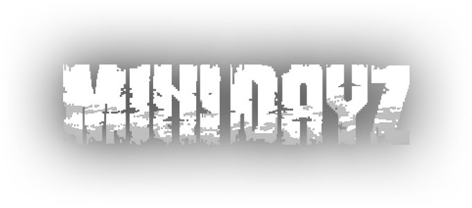
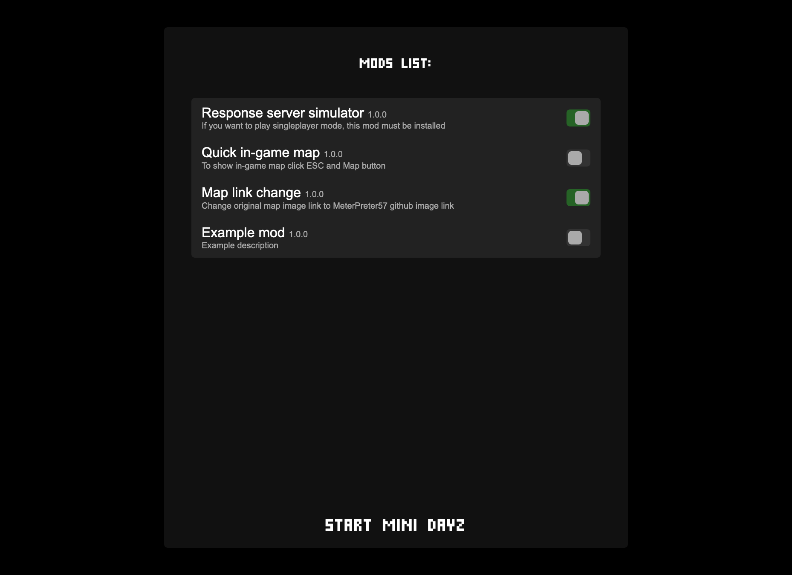

# PC Browser Mini DayZ


### Mods support added

### Progress saving works!
Thanks [W84Soft](https://github.com/W84Soft) for that.  
Click **Save and Exit** and wait until you will be back to the main menu.


# [Play in Browser](https://meterpreter57.github.io/minidayz_1.4.1/)

## Plans for the future:
1. [x] Restore c2runtime.js and data.js to original source code
2. [x] Add mods support without changing original files
	- [x] Mod selection from list
3. [x] Add server response simulator as mod
4. [x] Add working in-game map mod
5. [ ] Creating helpers for better game control and easier creation of mods

## Known issues:
#### Achievements and stats are not updated after death 
Reload the page
#### Game saving/mods/other recently added features don't work
1. Open the game  
2. If you want to preserve your save  
   2.1. Enable the `Save exporter & importer` mod  
   2.2. Export your save  
4. Open site information (top left corner near the url)
5. Go to **Site settings**
6. Click **Delete data**
7. Reload the game and import your save


## Mods
If you want to create your own mod, add javascript file to mods/ folder. Now you must to add install function which must be exported. 

Below is an example mod for listening to buttons that open links

#### example-script.js
```js
export function install(){
	const original_open=window.open;
	window.open=function(url, target, windowFeatures){
		console.log(url,target,windowFeatures);
		original_open(url,target,windowFeatures);
	}
}
```

Now you need to modify mods.json, add your new mod to list:

#### mods.json
```json
{
	"mods":[
		// Other mods:
		{...},
		// Your mod:
		{
			"name":"Example mod",
			"description":"Example description",
			"script":"example-script",
			"version":"1.0.0"
		}
	]
}
```

### Testing mods
Now you can start the server, e.g. via NodeJS http-server and run the game:

